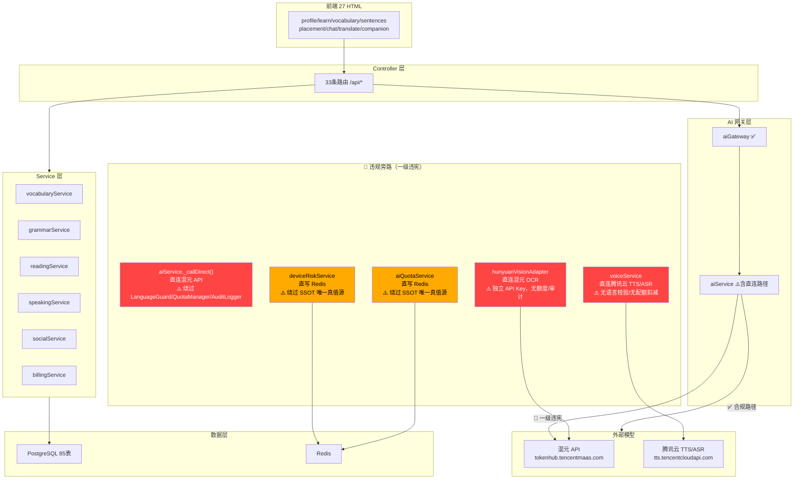
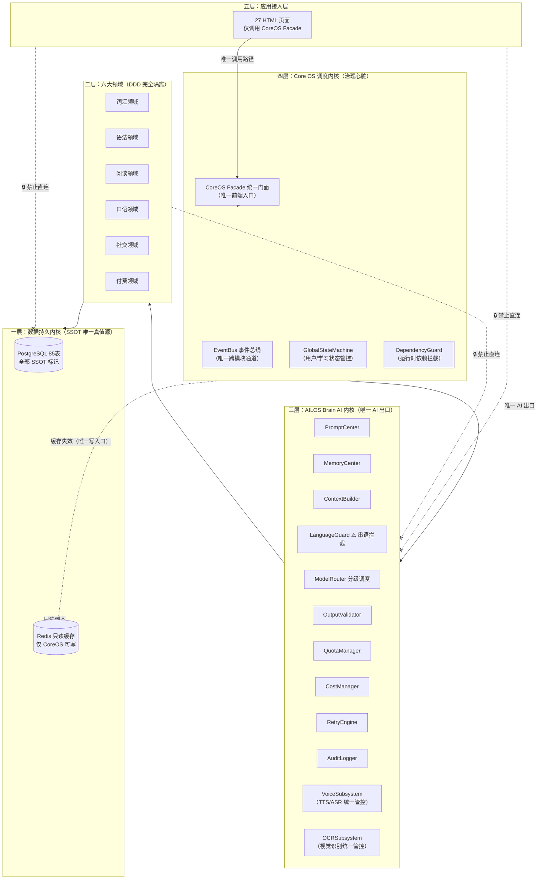
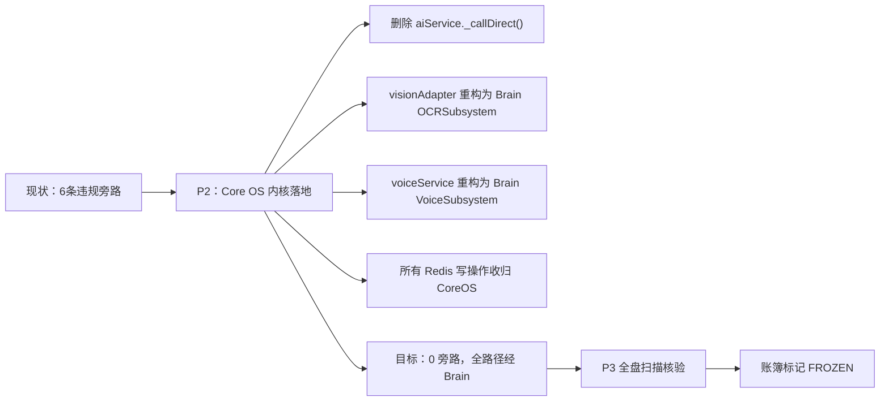

# 增补 1：AILOS 系统双版本拓扑图（现状版 vs 目标治理版）

> 文档性质：P0 强制增补项，现状版如实暴露所有违规旁路，目标版严格对齐 v3.0 宪法五层内核
> 关联宪法：CoreOS 第 0 编四大铁律、第 6 章 Brain 唯一出口

---

## 1.1 现状版拓扑图（如实暴露所有违规旁路）

### 现状版违规旁路清单

| # | 违规路径 | 违规类型 | 严重等级 | 文件位置 | 整改阶段 |
|---|---------|---------|---------|---------|---------|
| 1 | `aiService._callDirect()` → 混元 API | 绕过 Brain | 🔴 一级违宪 | `src/services/aiService.js:96-125` | P2 内核落地 |
| 2 | `hunyuanVisionAdapter` → 混元 OCR | 绕过 Brain | 🔴 一级违宪 | `src/services/ocr/hunyuanVisionAdapter.js:28` | P2 内核落地 |
| 3 | `voiceService` → 腾讯云 TTS | 绕过 Brain | 🔴 一级违宪 | `src/services/voiceService.js:120` | P2 内核落地 |
| 4 | `voiceService` → 腾讯云 ASR | 绕过 Brain | 🔴 一级违宪 | `src/services/voiceService.js:170` | P2 内核落地 |
| 5 | `deviceRiskService` → Redis.setex | 违反 SSOT | 🟡 二级故障 | `src/services/deviceRiskService.js:203` | P2 内核落地 |
| 6 | `aiQuotaService` → Redis.set | 违反 SSOT | 🟡 二级故障 | `src/services/aiQuotaService.js` | P2 内核落地 |
| 7 | `authService` → Redis.setex | 违反 SSOT | 🟡 二级故障 | `src/services/authService.js` | P2 内核落地 |

---

## 1.2 目标治理版拓扑图（严格对齐 v3.0 宪法五层内核）

---

## 1.3 整改路线图（现状→目标）

---

> **增补 1 版本**: v1.0 | **归档路径**: AILOS_指令中心/系统图谱/增补1_双版本拓扑图.md
