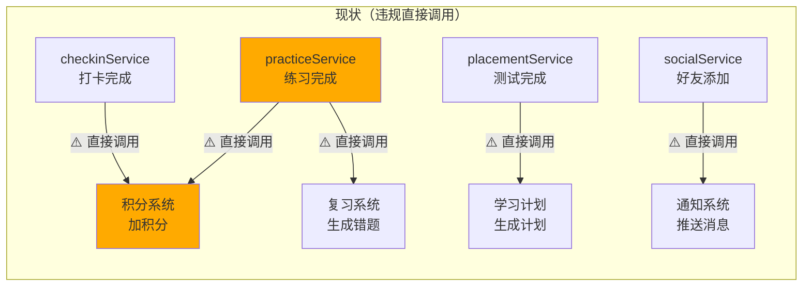
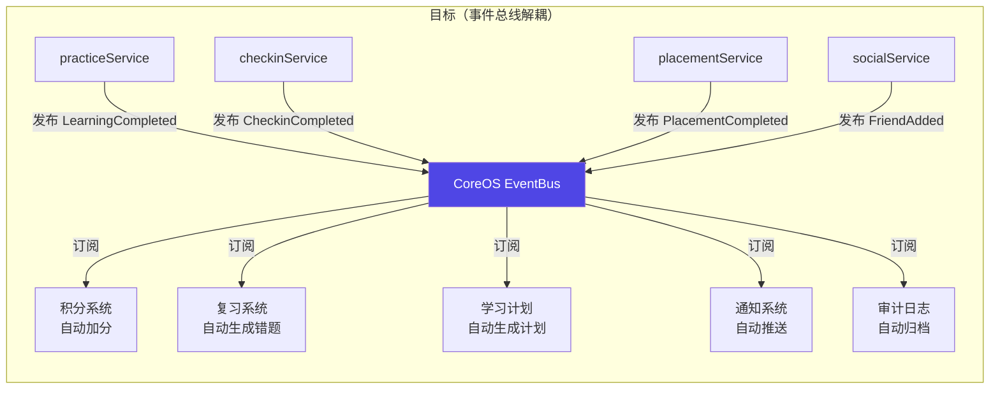

# 增补 6：事件总线现状-目标对比图

> 文档性质：P0 强制增补项，标注所有跨模块直接调用点，全部纳入违宪整改台账
> 关联宪法：CoreOS 第 2 章 EventBus、第 0.2 铁律 DDD

---

## 6.1 现状：跨模块直接调用链路



### 现状违规直接调用清单

| # | 调用方 | 被调用方 | 调用方式 | 违宪等级 | 整改阶段 |
|---|--------|---------|---------|---------|---------|
| 1 | practiceService | 积分系统 | 直接调用 addScore | 🟡 二级 | P2 |
| 2 | practiceService | 复习系统 | 直接调用 createReview | 🟡 二级 | P2 |
| 3 | checkinService | 积分系统 | 直接调用 addScore | 🟡 二级 | P2 |
| 4 | placementService | 学习计划 | 直接调用 generatePlan | 🟡 二级 | P2 |
| 5 | socialService | 通知系统 | 直接调用 sendNotification | 🟡 二级 | P2 |

## 6.2 目标：事件总线发布-订阅模式



## 6.3 整改路线

```
现状：5 处直接调用 → P2 EventBus 落地 → 全部改为发布-订阅 → P3 核验 0 直接调用 → FROZEN
```

---

> **增补 6 版本**: v1.0 | **归档路径**: AILOS_指令中心/系统图谱/增补6_事件总线对比图.md
