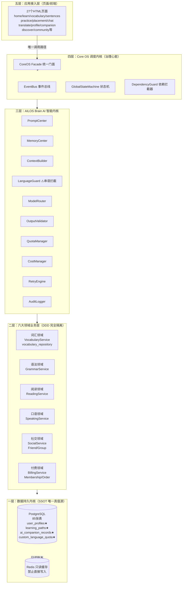

# 附录 A：AILOS System Atlas 系统总地图

> 文档性质：AILOS 项目唯一法定拓扑图纸，Git 只读归档，无总工程师审批不得修改
> 生成日期：2026-08-05
> 关联宪法：AILOS Core Constitution v3.0 第 0 编、附录 A 规范

---

## A.1 系统全景拓扑总图

## A.2 API 路由全景（413 条标准路由）

| # | 路由文件 | 路由前缀 | 主要端点 | 领域归属 |
|---|---------|---------|---------|---------|
| 1 | `auth.js` | `/api/auth` | login/register/logout/phone/password/send-code/wechat/guest | 用户领域 |
| 2 | `ai.js` | `/api/ai` | chat/translate/grammar-check/generate-exercise/stats/quota | Brain AI 内核 |
| 3 | `aiTutor.js` | `/api/ai/tutor` | dialogue/chat | Brain AI 内核 |
| 4 | `content.js` | `/api/content` | GET/GET summary/GET :id | 学习内容领域 |
| 5 | `learn.js` | `/api/learn` | content/:type/:lang/:level/config | 学习引擎领域 |
| 6 | `practice.js` | `/api/practice` | config/sentences/submit/report/review-questions/review-submit | 练习领域 |
| 7 | `blueprint.js` | `/api/blueprint` | question/course/config | 内容生成领域 |
| 8 | `vocabulary.js` | `/api/vocabulary` | words/practice/progress | 词汇领域 |
| 9 | `grammar.js` | `/api/grammar` | points/practice/progress | 语法领域 |
| 10 | `reading.js` | `/api/reading` | articles/questions/submit | 阅读领域 |
| 11 | `speaking.js` | `/api/speaking` | scenarios/practice/record | 口语领域 |
| 12 | `companion.js` | `/api/companion` | plan/daily/complete | AI 搭子领域 |
| 13 | `dailyPlan.js` | `/api/plan` | today/generate/complete/progress | 学习计划领域 |
| 14 | `onboarding.js` | `/api/onboarding` | status/identity/language/placement/goal/companion/plan | 新用户引导 |
| 15 | `placement.js` | `/api/placement` | start/submit/result | 定级测试 |
| 16 | `language.js` | `/api/language` | GET/PUT | 语言配置 |
| 17 | `languageBilling.js` | `/api/language/billing` | quota/history/check | 自定义语言付费 |
| 18 | `user.js` | `/api/user` | profile/languages/settings | 用户资料 |
| 19 | `profile.js` | `/api/user/profile` | avatar/nickname/birthday/gender | 个人中心 |
| 20 | `social.js` | `/api/v1/social` | privacy/friends/groups/posts/timeline | 社交领域 |
| 21 | `billing.js` | `/api/billing` | packages/buy/payment/membership | 付费领域 |
| 22 | `membership.js` | `/api/membership` | plans/status/orders/proxy | 会员领域 |
| 23 | `checkin.js` | `/api/checkin` | GET/status/POST | 打卡签到 |
| 24 | `dashboard.js` | `/api/dashboard` | GET | 首页仪表盘 |
| 25 | `reports.js` | `/api/reports` | GET/summary/xp-history | 学习报告 |
| 26 | `reviews.js` | `/api/reviews` | due/due-count/stats/submit | 复习系统 |
| 27 | `feedback.js` | `/api/feedback` | types/POST/list | 反馈系统 |
| 28 | `avatar.js` | `/api/avatar` | POST | 头像上传 |
| 29 | `voice.js` | `/api/v1/voice` | tts/asr | 语音 TTS |
| 30 | `qrcode.js` | `/api/user/share-qrcode` | GET | 二维码 |
| 31 | `customContent.js` | `/api/content/custom` | GET/POST | 自定义强化 |
| 32 | `translate.js` | `/api/translate` | text/image/voice | 翻译引擎 |
| 33 | `admin.js` | `/api/admin` | users/orders/memberships/logs | 管理后台 |

## A.3 数据库 SSOT 主表清单（85 张表核心标记）

| 表名 | SSOT 标记 | 用途 | 关联宪法条款 |
|------|----------|------|------------|
| `user_profiles` | ★ SSOT | 用户三维语言、等级、兴趣 | 产品宪法 9.2 / CoreOS 0.1 |
| `learning_paths` | ★ SSOT | 用户学习等级、进度 | 产品宪法 1.2 |
| `ai_companion_records` | ★ SSOT | AI 搭子配置、记忆 | 产品宪法 2.1 |
| `custom_language_quota` | ★ SSOT | 自定义语言额度 | 技术宪法 E.4 |
| `users` | ★ SSOT | 用户主表 | 技术宪法 1.1 |
| `learning_content` | SSOT | 学习内容库 | 技术宪法 3.1 |
| `daily_learning_plan` | SSOT | 每日学习计划 | 产品宪法 1.2 |
| `billing_orders` | SSOT | 付费订单 | 技术宪法 C.7 |
| `vocabulary_words` | SSOT | 词汇库 | 词汇领域 |
| `grammar_points` | SSOT | 语法点库 | 语法领域 |
| `reading_articles` | SSOT | 阅读文章库 | 阅读领域 |
| `practice_records` | SSOT | 练习记录 | 练习领域 |
| `checkin_records` | SSOT | 打卡记录 | 签到领域 |
| `social_friends` | SSOT | 好友关系 | 社交领域 |
| `social_groups` | SSOT | 群组 | 社交领域 |
| `social_posts` | SSOT | 动态帖子 | 社交领域 |
| `companion_profile` | SSOT | 伴读配置 | AI 搭子领域 |
| `invite_records` | SSOT | 邀请记录 | 分销领域 |
| `audit_logs` | SSOT | 审计日志 | CoreOS 6.2 |

## A.4 前端页面全清单（27 个 HTML）

| # | 页面 | 路径 | 领域归属 | 底部导航 |
|---|------|------|---------|---------|
| 1 | 首页 | `home.html` | 仪表盘 | ✅ 7 Tab |
| 2 | 学习中心 | `learn.html` | 学习引擎 | ✅ 7 Tab |
| 3 | 词汇学习 | `vocabulary.html` | 词汇领域 | ❌ 二级页 |
| 4 | 句库 | `sentences.html` | 语法/阅读 | ❌ 二级页 |
| 5 | 口语速成 | `practice.html` | 口语领域 | ❌ 二级页 |
| 6 | 定级测试 | `placement.html` | 新用户引导 | ❌ 二级页 |
| 7 | AI 对话 | `chat.html` | AI 搭子 | ✅ 7 Tab |
| 8 | 翻译 | `translate.html` | 翻译引擎 | ❌ 二级页 |
| 9 | 个人中心 | `profile.html` | 用户领域 | ✅ 7 Tab |
| 10 | 伴读 | `companion.html` | AI 搭子 | ✅ 7 Tab |
| 11 | 复习 | `review.html` | 复习领域 | ✅ 7 Tab |
| 12 | 发现/社交 | `discover.html` | 社交领域 | ✅ 7 Tab |
| 13 | 社区 | `community.html` | 社交领域 | ❌ 二级页 |
| 14 | 好友 | `friends.html` | 社交领域 | ❌ 二级页 |
| 15 | 消息 | `messages.html` | 社交领域 | ❌ 二级页 |
| 16 | 登录 | `login.html` | 用户领域 | ❌ |
| 17 | 注册 | `register.html` | 用户领域 | ❌ |
| 18 | 新用户引导 | `onboarding.html` | 新用户引导 | ❌ |
| 19 | 成长中心 | `growth-center.html` | 分销/邀请 | ❌ |
| 20 | 会员 | `membership.html` | 付费领域 | ❌ |
| 21 | 设置 | `settings.html` | 用户领域 | ❌ |
| 22 | 错题本 | `notebook.html` | 复习领域 | ❌ |
| 23 | 游戏中心 | `games.html` | 游戏领域 | ❌ |
| 24 | 词库 | `wordbank.html` | 词汇领域 | ❌ |
| 25 | 进度 | `progress.html` | 学习报告 | ❌ |
| 26 | 关于 | `about.html` | 通用 | ❌ |
| 27 | 隐私 | `privacy.html` | 通用 | ❌ |

---

> **附录 A 版本**: v1.0 | **归档路径**: AILOS_指令中心/系统图谱/附录A_系统总地图.md
> **冻结状态**: DRAFT → 待总工程师审批 Frozen
