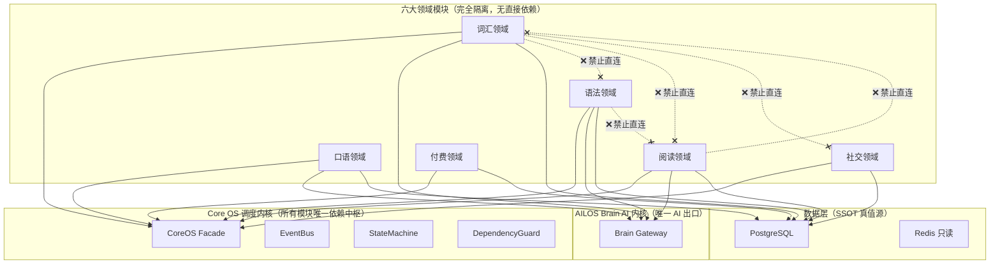

# 附录 B：全模块 Dependency 依赖黑白名单图

> 文档性质：AILOS 项目唯一法定依赖拓扑图纸，Git 只读归档
> 关联宪法：AILOS Core Constitution v3.0 第 4 章 DependencyGuard、第 0.2 铁律

---

## B.1 全局依赖拓扑总图

## B.2 各领域模块 Allowed / Forbidden 清单

### B.2.1 词汇领域 VocabularyService

| 类型 | 组件 | 说明 |
|------|------|------|
| ✅ Allowed | CoreOS Facade | 统一门面 |
| ✅ Allowed | AILOS Brain 内核 | 词汇 AI 生成 |
| ✅ Allowed | vocabulary_repository | 词汇主库 SSOT |
| ✅ Allowed | EventBus 发布接口 | 发布 LearningCompleted 等事件 |
| ✅ Allowed | user_profiles（只读） | 读取用户等级 |
| ❌ Forbidden | ReadingService | 阅读领域（跨领域） |
| ❌ Forbidden | GrammarService | 语法领域（跨领域） |
| ❌ Forbidden | SpeakingService | 口语领域（跨领域） |
| ❌ Forbidden | PaymentService | 付费领域（跨领域） |
| ❌ Forbidden | SocialService | 社交领域（跨领域） |
| ❌ Forbidden | 直连 DeepSeek/混元 API | 绕过 Brain 内核 |
| ❌ Forbidden | Redis 写操作 | 违反 SSOT |

### B.2.2 语法领域 GrammarService

| 类型 | 组件 | 说明 |
|------|------|------|
| ✅ Allowed | CoreOS Facade | 统一门面 |
| ✅ Allowed | AILOS Brain 内核 | 语法 AI 生成 |
| ✅ Allowed | grammar_repository | 语法主库 SSOT |
| ✅ Allowed | EventBus 发布接口 | 发布事件 |
| ✅ Allowed | user_profiles（只读） | 读取用户等级 |
| ❌ Forbidden | VocabularyService | 词汇领域 |
| ❌ Forbidden | ReadingService | 阅读领域 |
| ❌ Forbidden | 直连任何大模型 API | 绕过 Brain |

### B.2.3 阅读领域 ReadingService

| 类型 | 组件 | 说明 |
|------|------|------|
| ✅ Allowed | CoreOS Facade | 统一门面 |
| ✅ Allowed | AILOS Brain 内核 | 阅读 AI 生成 |
| ✅ Allowed | reading_repository | 阅读主库 SSOT |
| ✅ Allowed | EventBus 发布接口 | 发布事件 |
| ❌ Forbidden | VocabularyService | 词汇领域 |
| ❌ Forbidden | GrammarService | 语法领域 |
| ❌ Forbidden | 零散单词凑阅读 | 产品宪法 1.4 禁止 |

### B.2.4 口语领域 SpeakingService

| 类型 | 组件 | 说明 |
|------|------|------|
| ✅ Allowed | CoreOS Facade | 统一门面 |
| ✅ Allowed | AILOS Brain 内核 | 口语 AI 生成 |
| ✅ Allowed | speaking_repository | 口语主库 SSOT |
| ✅ Allowed | voice TTS/ASR | 语音合成/识别 |
| ❌ Forbidden | 直连外部 TTS 服务 | 绕过 Brain |

### B.2.5 社交领域 SocialService

| 类型 | 组件 | 说明 |
|------|------|------|
| ✅ Allowed | CoreOS Facade | 统一门面 |
| ✅ Allowed | social_repository | 社交主库 SSOT |
| ✅ Allowed | EventBus 发布接口 | 发布社交事件 |
| ❌ Forbidden | 任何学习领域 | 跨领域 |
| ❌ Forbidden | 付费领域 | 跨领域 |
| ❌ Forbidden | AI 生成内容（无 Brain） | 绕过内核 |

### B.2.6 付费领域 BillingService

| 类型 | 组件 | 说明 |
|------|------|------|
| ✅ Allowed | CoreOS Facade | 统一门面 |
| ✅ Allowed | billing_repository | 付费主库 SSOT |
| ✅ Allowed | 第三方支付 SDK | 微信/支付宝 |
| ❌ Forbidden | 任何学习领域 | 跨领域 |
| ❌ Forbidden | 社交领域 | 跨领域 |
| ❌ Forbidden | 前端直传支付参数 | 安全风险 |

---

> **附录 B 版本**: v1.0 | **归档路径**: AILOS_指令中心/系统图谱/附录B_依赖黑白名单图.md
