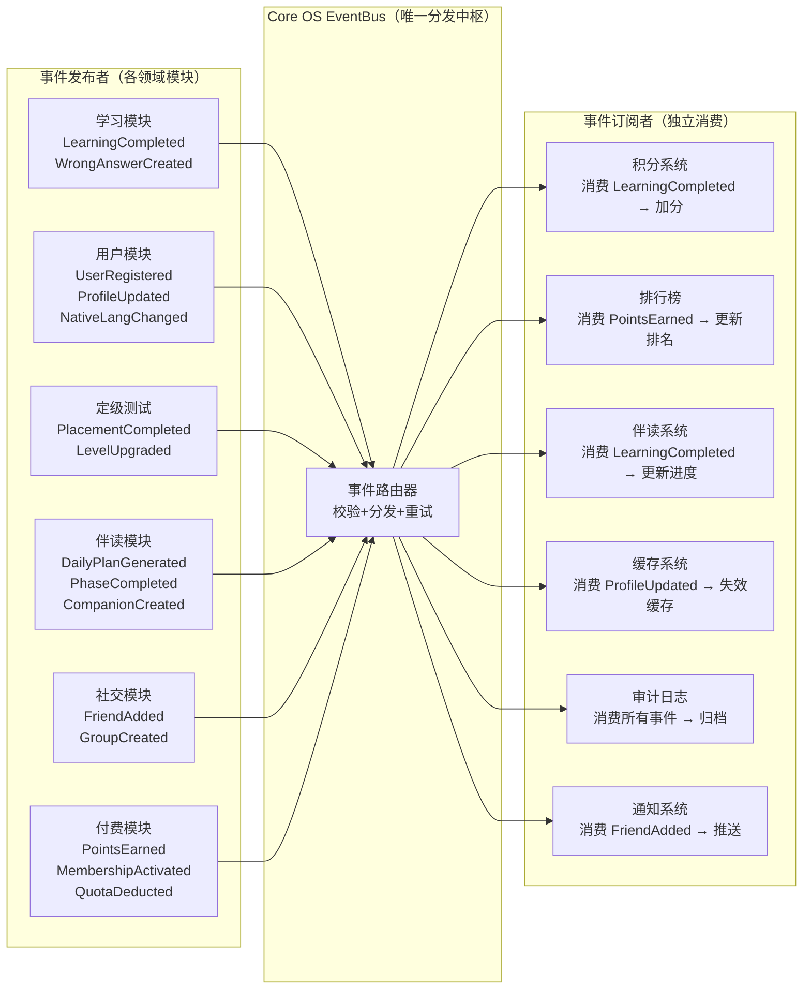

# 附录 C：EventBus 事件总线完整图谱

> 关联宪法：AILOS Core Constitution v3.0 第 2 章

## C.1 事件总线全局发布-订阅拓扑



## C.2 标准事件清单

| 事件名 | 触发源 | 订阅者 | Payload | 重试策略 |
|--------|--------|--------|---------|---------|
| `UserRegistered` | auth 注册 | 新用户引导/审计 | userId, phone, timestamp | 3次 |
| `ProfileUpdated` | user/profile | 缓存失效/审计 | userId, changedFields | 3次 |
| `NativeLangChanged` | language | AI ContextBuilder/缓存 | userId, oldLang, newLang | 3次 |
| `PlacementCompleted` | placement | 学习计划生成/伴读 | userId, level, score, lang | 3次 |
| `LevelUpgraded` | learning_paths | 首页/伴读/成就 | userId, oldLevel, newLevel | 3次 |
| `DailyPlanGenerated` | companion/dailyPlan | 首页/通知 | userId, planId, tasks | 3次 |
| `LearningCompleted` | practice | 积分/排行榜/伴读/审计 | userId, phase, score, duration | 3次 |
| `WrongAnswerCreated` | practice | 错题本/复习系统 | userId, questionId, answer | 3次 |
| `PhaseCompleted` | dailyPlan | 伴读/进度 | userId, phase, nextPhase | 3次 |
| `CompanionCreated` | onboarding | 首页/通知 | userId, companionConfig | 3次 |
| `PointsEarned` | 积分系统 | 排行榜/通知 | userId, points, reason | 3次 |
| `MembershipActivated` | billing | 首页/权益 | userId, planType, expireAt | 3次 |
| `QuotaDeducted` | languageBilling | 配额缓存/审计 | userId, lang, remaining | 3次 |
| `FriendAdded` | social | 通知/动态 | userId, friendId | 3次 |
| `GroupCreated` | social | 通知/动态 | userId, groupId | 3次 |

## C.3 事件标准格式

```json
{
  "eventId": "UUID v4",
  "eventName": "LearningCompleted",
  "userId": "df440e3c-56cc-4455-8426-9a279bc58f6c",
  "triggerSource": "practice",
  "payload": { "phase": "vocabulary", "score": 85, "duration": 600 },
  "triggerAt": "2026-08-05T12:00:00Z",
  "traceId": "trace-uuid"
}
```

---

> **附录 C 版本**: v1.0 | **归档路径**: AILOS_指令中心/系统图谱/附录C_事件总线图.md
