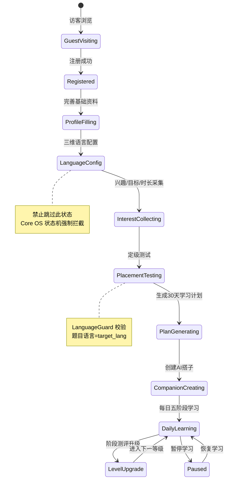
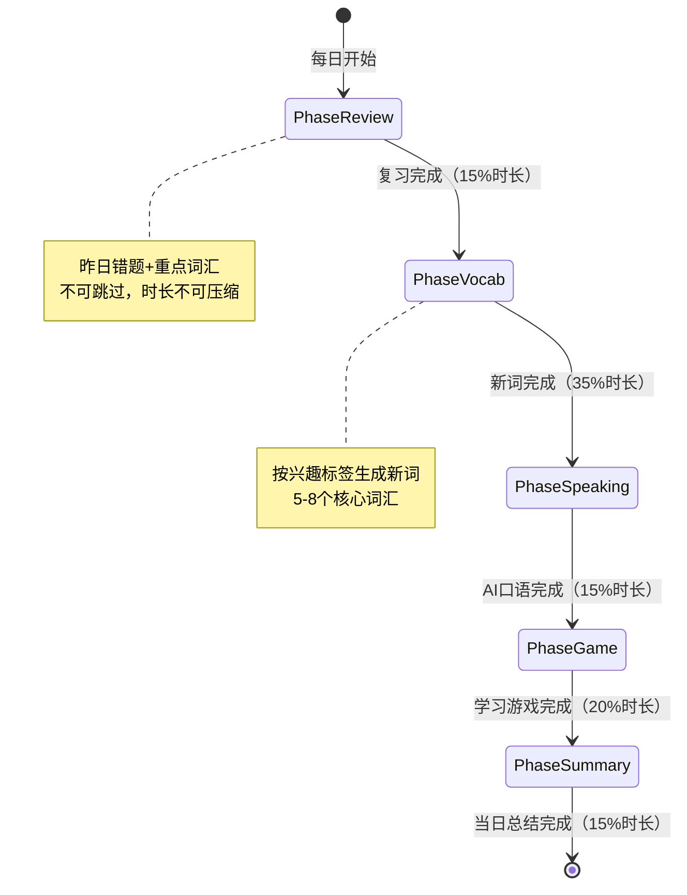

# 附录 D：用户/学习双状态机完整流转图

> 关联宪法：AILOS Core Constitution v3.0 第 3 章 GlobalStateMachine

## D.1 UserLifecycle 用户生命周期状态机



## D.2 DailyLearning 每日学习五阶段状态机



## D.3 状态变更唯一通道

```
前端 → CoreOS.sendCommand(StateTransitionCommand) → StateMachine.validate() → 合法？→ 切换状态
                                                                              → 不合法？→ 返回 9001 拦截
```

---

> **附录 D 版本**: v1.0 | **归档路径**: AILOS_指令中心/系统图谱/附录D_状态机流转图.md
