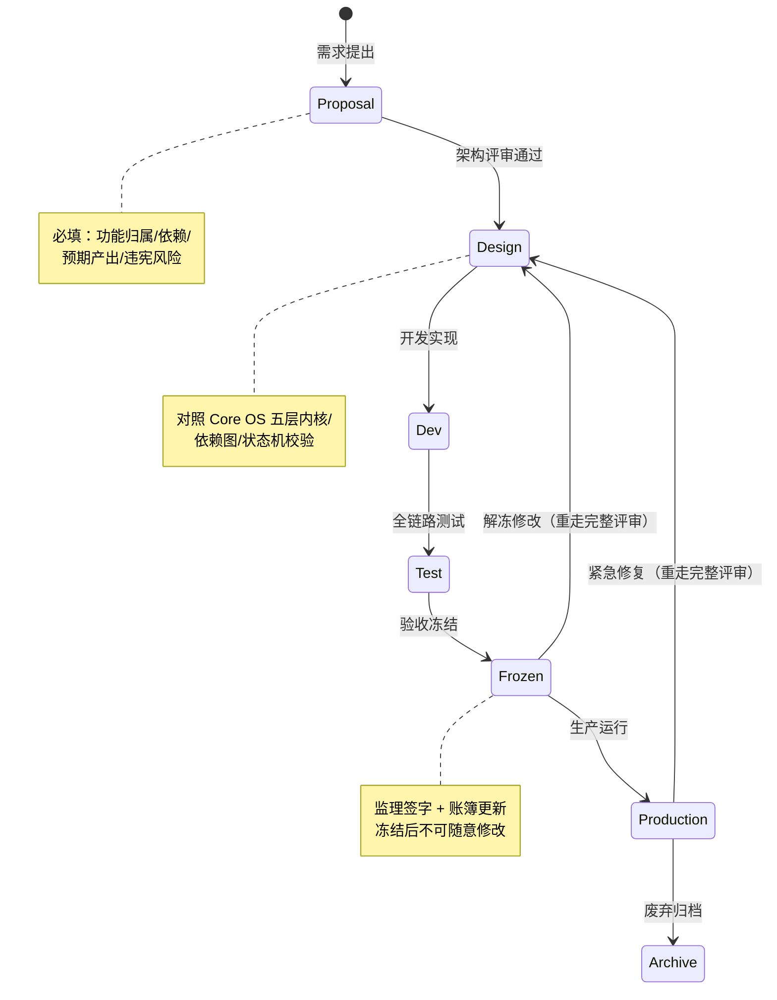

# 附录 E：全功能 Lifecycle 生命周期总图

> 关联宪法：AILOS Core Constitution v3.0 第 5 章、第 0.4 铁律

## E.1 七阶段标准生命周期

## E.2 各阶段必填字段

| 阶段 | 必填项 | 产出物 | 审批人 |
|------|--------|--------|--------|
| Proposal | 功能归属、依赖清单、预期产出、违宪风险评估 | 提案文档 | 产品负责人 |
| Design | Core OS 层级归属、依赖黑白名单、状态机节点 | 架构设计文档 | 架构师 |
| Dev | Git 分支、代码文件清单 | 代码提交 | 开发者 |
| Test | 产品13条一票否决、技术合规扫描、截图证据 | 测试报告 | 监理 |
| Frozen | 监理签字、账簿更新 | Frozen 标记 | 总工程师 |
| Production | 部署 SHA、冒烟校验 | 部署记录 | 运维 |
| Archive | 下线方案、数据迁移 | 归档记录 | 总工程师 |

## E.3 当前项目模块生命周期状态

| 模块 | 当前阶段 | 冻结状态 |
|------|---------|---------|
| 词汇学习 vocabulary | Production | ❌ 未 Frozen |
| 语法学习 grammar | Production | ❌ 未 Frozen |
| 阅读学习 reading | Production | ❌ 未 Frozen |
| 口语练习 speaking | Production | ❌ 未 Frozen |
| 定级测试 placement | Production | ❌ 未 Frozen |
| AI 对话 chat | Production | ❌ 未 Frozen |
| 翻译引擎 translate | Production | ❌ 未 Frozen |
| 伴读 companion | Dev | ❌ 未 Frozen |
| 社交 social | Dev | ❌ 未 Frozen |
| 付费 billing | Dev | ❌ 未 Frozen |
| 分销 invite | Dev | ❌ 未 Frozen |

---

> **附录 E 版本**: v1.0 | **归档路径**: AILOS_指令中心/系统图谱/附录E_全生命周期图.md
