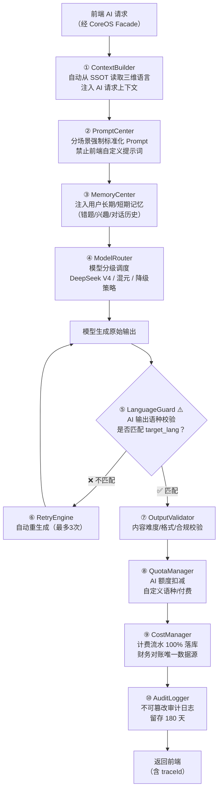

# 附录 F：AILOS Brain AI 内核分层流程图

> 关联宪法：AILOS Core Constitution v3.0 第 6 章 AILOS Brain AI 智能内核

## F.1 Brain 内核十大子系统全链路

## F.2 LanguageGuard 串语拦截规则（最高优先级）

| 校验项 | 规则 | 违规处置 |
|--------|------|---------|
| 目标语言匹配 | 输出语种 = user_profiles.target_lang | 自动重生成 |
| 禁止英语兜底 | 非英语用户禁止出现英语单词 | 拦截+告警 |
| 禁止跨语种混出 | 一句话内出现多种语言 | 拦截 |
| 三级失败 | 重试3次仍不匹配 | 返回错误码 9003 |
| 审计留痕 | 每次拦截记录 audit_logs | 永久留存 |

## F.3 ModelRouter 分级调度策略

| 场景 | 主模型 | 降级模型 | 触发条件 |
|------|--------|---------|---------|
| 日常对话 | DeepSeek V4 Pro | 混元 Turbo | 超时 30s |
| 语法讲解 | DeepSeek V4 Pro | 混元 Turbo | 超时 30s |
| 阅读生成 | DeepSeek V4 Pro | 混元 Turbo | 超时 60s |
| 翻译 | DeepSeek V4 Pro | 混元 Turbo | 超时 15s |
| TTS | 腾讯云 TTS | 本地兜底 | 网络异常 |
| 题目生成 | DeepSeek V4 Pro | 混元 Turbo | 超时 45s |

---

> **附录 F 版本**: v1.0 | **归档路径**: AILOS_指令中心/系统图谱/附录F_Brain内核流程图.md
