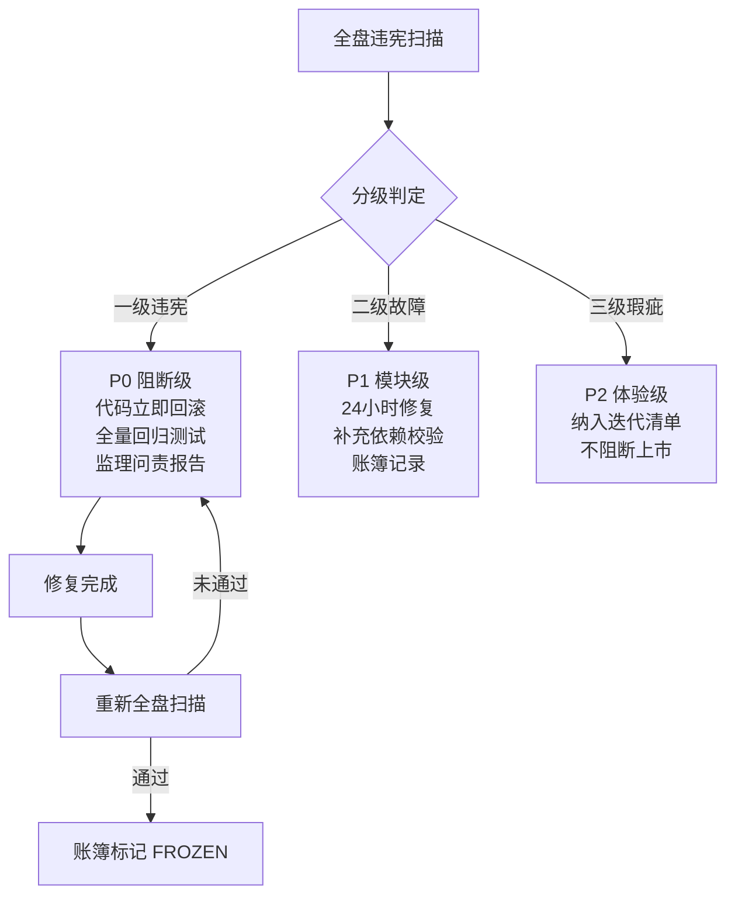

# 附录 H：上市缺陷闭环处置流程

> 关联宪法：AILOS Core Constitution v3.0 第 7 章、附录 H

## H.1 违宪分级处置流程



## H.2 一级违宪典型场景

| # | 违规场景 | 违反铁律 | 处置 |
|---|---------|---------|------|
| 1 | 绕过 Brain 直连大模型 | 0.4 | 代码回滚+全量回归+问责报告 |
| 2 | 绕过 DB 直接修改缓存 | 0.1 SSOT | 同上 |
| 3 | 模块硬编码其他领域业务 | 0.2 DDD | 同上 |
| 4 | 硬编码默认语种导致串语 | 产品宪法 9.2 | 同上 |
| 5 | 绕过事件总线直接跨模块调用 | 0.4 / 2.4 | 同上 |

## H.3 上市准入判定标准

```
上市准入 = P0 一级违宪项全部 FROZEN
         + P1 二级故障有明确迭代计划
         + 附录 G 四维审计全部通过
         + Git 发布基线已锁定
         + 总工程师终审签字
```

## H.4 违宪归集流程

1. 扫描发现 → 录入审计子账簿（绑定图谱位置/代码文件/Git SHA）
2. 分级判定 → 匹配宪法条款/违宪等级
3. 修复闭环 → 代码修复+回归测试+监理验收
4. 账簿 Frozen → 更新审计子账簿状态
5. 同类归集 → 统一批量修复，二次核验

---

> **附录 H 版本**: v1.0 | **归档路径**: AILOS_指令中心/系统图谱/附录H_上市闭环规则.md
